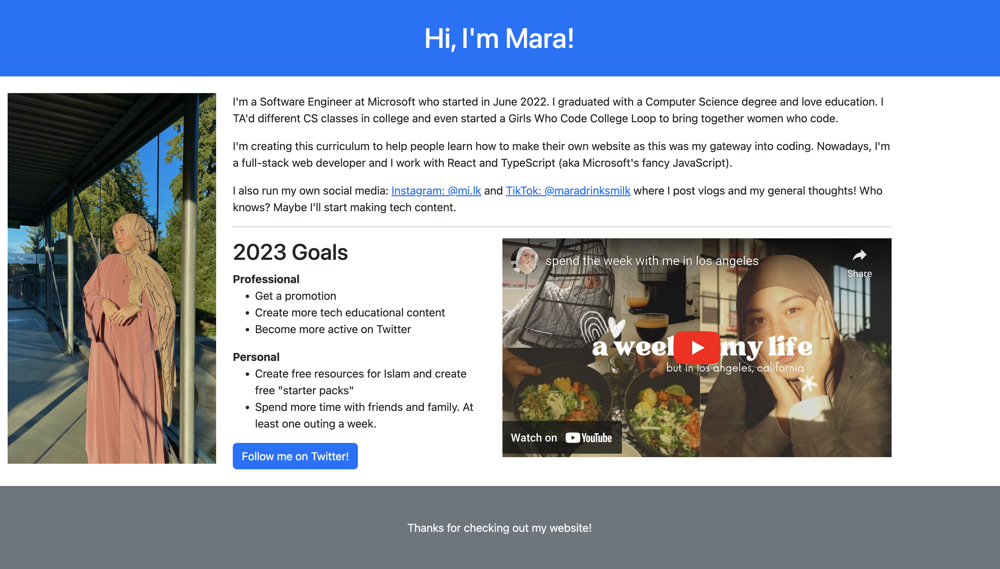
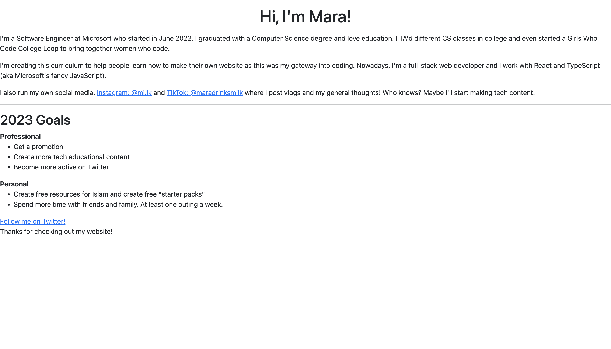
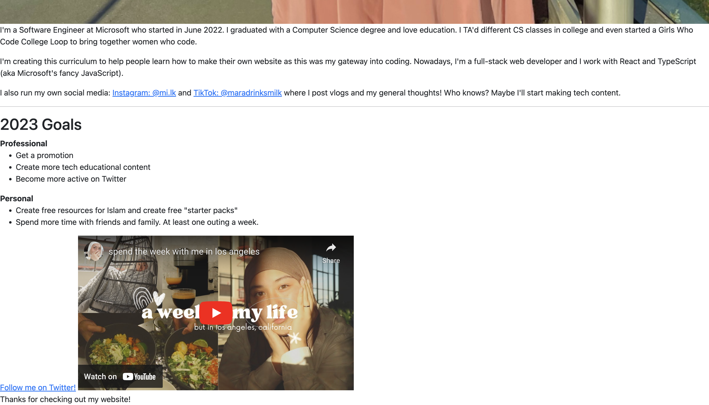

# Your First Website (Part 1)
Click [here](https://www.canva.com/design/DAFVdACYRhk/e_bRAfxumAsTqf5L7A9qXg/view?website#4) to see the accompanying slides.

Click [here](https://replit.com/@maralihart/YFW1?v=1) to see the Repl.

[Part 2](https://github.com/maralihart/YFW2) |
[Part 3](https://github.com/maralihart/YFW3)

**Completed View**

### Step 1
Start with a blank body (you can fork this repo and use `index.html` provided in main.)

### Step 2
Add all your HTML

### Step 3
Introduce media, like an image and YouTube video

### Step 4
Clean it up with Bootstrap

